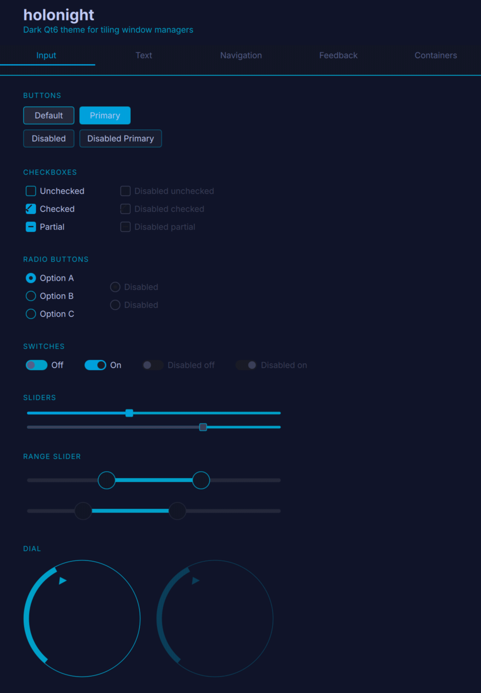
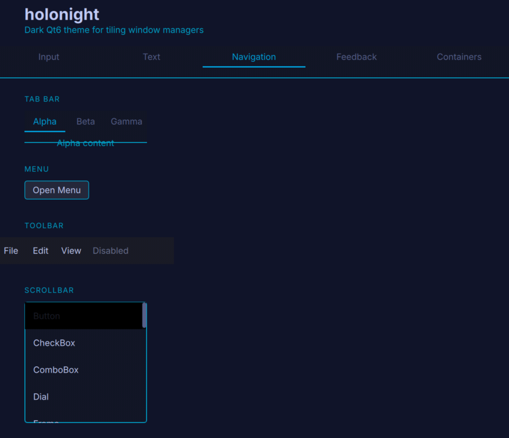
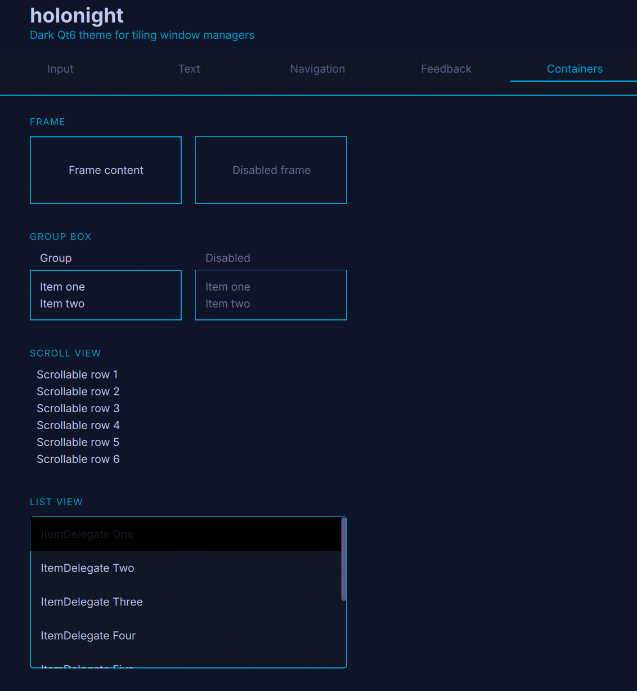
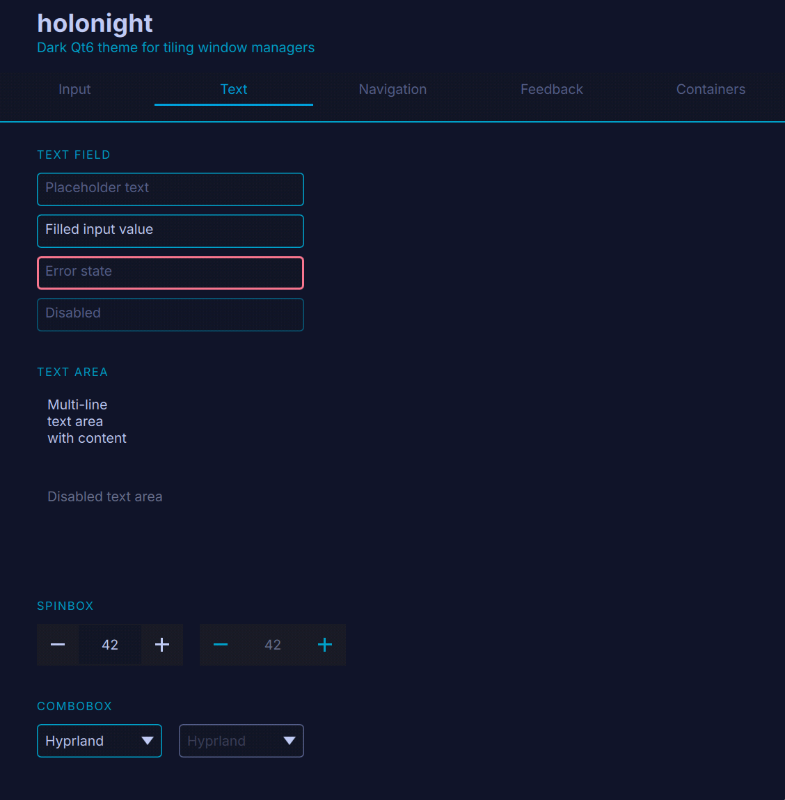
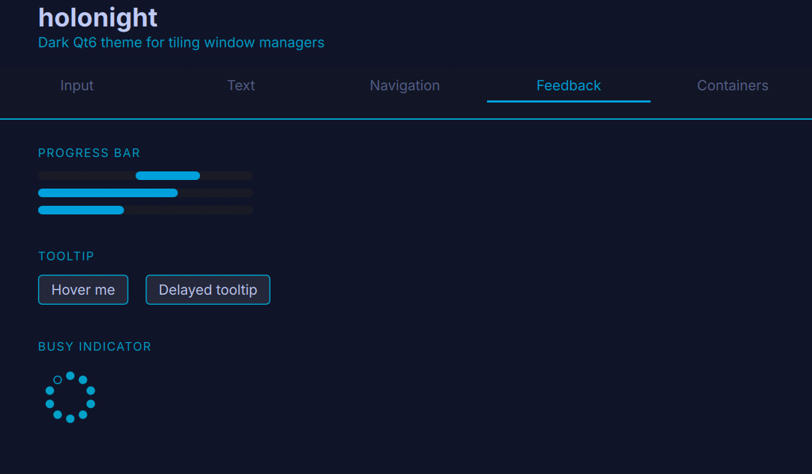

# HoloNight

HoloNight Qt Theme is the Qt/Qt Quick Controls theme component of the broader HoloNight desktop visual system.

This repository contains only the Qt theme implementation. The shell, icon theme, and GTK theme are planned as separate repositories.

## Screenshots

| Input | Navigation | Containers |
|:---:|:---:|:---:|
|  |  |  |

| Text | Feedback |
|:---:|:---:|
|  |  |

## Layers

| Layer | Output | Activation |
|---|---|---|
| `style/` | `libholonight.so` — QStyle plugin | `QT_STYLE_OVERRIDE=holonight` |
| `platformtheme/` | `libqholonight.so` — QPlatformTheme plugin | `QT_QPA_PLATFORMTHEME=holonight` |
| `qml/` | QQC2 components (Button, CheckBox, RadioButton, ComboBox, Slider, Switch, ProgressBar, TabBar, TabButton, Menu, MenuItem, ToolTip, ScrollBar, TextField) | `import Holonight` |
| `palette/` | `libholonight_palette.a` — shared color tokens | static dependency |
| `config/` | `libholonight_config.a` — shared theme configuration loader | consumed by platform theme, style, and QML |

Using `QT_QPA_PLATFORMTHEME=holonight` is the recommended activation method — it loads the style and QML layers automatically.

KDE color schemes are also installed to `share/color-schemes`: `data/holonight.colors` for dark mode and
`data/holonight-day.colors` for light mode.

## Palette

HoloNight ships a scheme catalog selected with `tokensForScheme(ThemeSchemeKind)`: **HoloNight Dark**, **HoloNight Light**, **TokyoNight Storm**, and **TokyoNight Day**. `appearance/scheme` is the canonical config selector; legacy `appearance/mode` is only used as a fallback when no valid scheme is present. All resolved colors and metrics originate in `palette/holonight/palette.h`, and downstream layers consume that token model rather than hard-coded color values.

The preferred public token roles are canonical names such as `background`, `surface`, `surfaceElevated`, `surfaceRaised`, `textPrimary`, `textMuted`, `borderPassive`, `borderActive`, and `borderFocus`. Older names such as `surfaceVariant`, `surfaceContainer`, `onSurface`, `outline`, and `textSubtle` remain available as deprecated compatibility aliases.

Key HoloNight Dark defaults:

| Role | Value | Usage |
|---|---|---|
| `background` | `#0C1118` | Main window/background plane |
| `surface` | `#131A24` | Views, text fields, and recessed base surfaces |
| `surfaceElevated` | `#18212D` | Cards, alternate rows, side/status panels |
| `surfaceRaised` | `#202B39` | Buttons, menus, popovers, raised controls |
| `textPrimary` | `#E7EDF5` | Normal text and icons |
| `textSecondary` | `#C5D0DE` | Secondary readable text |
| `textMuted` | `#8D99AD` | Placeholder and inactive text |
| `textDisabled` | `#5B6678` | Disabled UI text |
| `primary` | `#5EA2FF` | Selection/link fill |
| `borderFocus` | `#56D7FF` | Keyboard focus only |
| `borderActive` | `#5EA2FF` | Current, selected, or active border |
| `borderPassive` | `#36465A` | Passive frames and separators |

The token model also includes semantic status colors, overlay/effect tokens, radius and metric tokens, workspace indicators, and ANSI terminal colors. See [`docs/theme-tokens.md`](docs/theme-tokens.md) for the full schema, deprecated alias mapping, Qt palette mapping, variant status, and future `config.toml` shape.

WCAG AA contrast (4.5:1) is enforced by the test suite for text and selection pairs. Non-text UI components such as focus rings and active borders are tested at the WCAG 1.4.11 threshold of 3:1. Known intentional deviations from the design-system color table are documented in [`docs/holonight-design-deviations.md`](docs/holonight-design-deviations.md).

## Requirements

- Qt 6.11+
- CMake 3.25+
- Ninja
- GTest (for tests)

## Build from source

```bash
cmake -B build -G Ninja -DCMAKE_BUILD_TYPE=Release
cmake --build build -j$(nproc)
sudo cmake --install build --prefix /usr
```

Install to a local prefix (no sudo, useful during development):

```bash
cmake --install build --prefix ~/.local
```

With [Task](https://taskfile.dev):

```bash
task install:system   # Release build → /usr (sudo)
task install:local    # Debug build → ~/.local
```

## Usage

```bash
# Platform theme (recommended — loads style + QML automatically)
QT_QPA_PLATFORMTHEME=holonight your-qt-app

# Style only
QT_STYLE_OVERRIDE=holonight your-qt-app
```

To make this permanent, export `QT_QPA_PLATFORMTHEME=holonight` in your compositor environment (e.g. `~/.config/hypr/hyprland.conf`, `~/.config/sway/config`, or `/etc/environment`).

## Configuration

HoloNight loads user-facing theme configuration from:

```text
~/.config/holonight/theme.conf
```

If `theme.conf` does not exist, it falls back to the legacy JSON file:

```text
~/.config/holonight/theme.json
```

`HOLONIGHT_CONFIG_FILE` can point at another file for testing. Environment variables override file values and are intended for development/debugging.
The canonical token schema, Qt palette mapping, variant status, and future `config.toml` shape are documented in [`docs/theme-tokens.md`](docs/theme-tokens.md).

Default JSON:

```json
{
  "appearance": {
    "scheme": "holonight-dark",
    "accent": "cyan",
    "mode": "dark"
  },
  "icons": {
    "theme": "HoloNight",
    "fallback": "Papirus"
  },
  "fonts": {
    "ui": "Inter",
    "fixed": "JetBrains Mono",
    "baseSize": 10
  },
  "scaleFactor": 1.0
}
```

For INI config, use:

```ini
[appearance]
scheme=holonight-dark
accent=cyan
mode=dark
```

Supported appearance schemes are `holonight-dark`, `holonight-light`, `tokyonight-storm`, and `tokyonight-day`.
The `scheme` value is the canonical selector. `mode` remains supported as legacy fallback metadata: `light` resolves to `holonight-light`, while `dark`, `system`, missing, or invalid values resolve to `holonight-dark` when no valid `scheme` is present.
Supported accents are `cyan`, `blue`, `violet`, and `yellow`; missing or invalid accents resolve to `cyan`.

`baseSize` is the body font size. Derived sizes are `caption = baseSize - 1`, `title = baseSize + 3`, and `heading = baseSize + 6`.

Supported environment overrides:

```bash
HOLONIGHT_CONFIG_FILE=/path/to/theme.json
HOLONIGHT_ICON_THEME=Papirus-Dark
HOLONIGHT_FALLBACK_ICON_THEME=Papirus
HOLONIGHT_FONT="Noto Sans"
HOLONIGHT_FIXED_FONT="JetBrains Mono"
HOLONIGHT_FONT_SIZE=10
HOLONIGHT_SCALE_FACTOR=1.0
HOLONIGHT_APPEARANCE_MODE=dark
```

The same loaded values are exposed to QML through the `HolonightTheme` singleton:

```qml
import Holonight

Item {
    property string iconTheme: HolonightTheme.iconTheme
    property string uiFont: HolonightTheme.uiFont
    property int bodySize: HolonightTheme.bodySize
    property int captionSize: HolonightTheme.captionSize
}
```

## Development

```bash
# Configure, build, and test
task build
task test

# Full pre-commit checklist (build + clang-tidy + tests)
task verify

# Visual demo app
task demo
task demo -- --theme=tokyonight-day
```

Manual equivalents:

```bash
cmake -B build -G Ninja -DCMAKE_BUILD_TYPE=Debug -DBUILD_TESTS=ON
cmake --build build -j$(nproc)
QT_QPA_PLATFORM=offscreen ctest --test-dir build --output-on-failure
```

## Architecture

- **All colors** originate in `palette/holonight/palette.h` (`tokensForScheme(ThemeSchemeKind)` → `buildPalette()`). Change colors there, nowhere else.
- **Configuration** is loaded once per consumer through `holonight_config`: defaults, config file, then environment overrides.
- **QML module URI** is `Holonight` (capital N). Use `import Holonight` in QML files to access all components plus the `HoloniightPalette` and `HolonightTheme` singletons. A lowercase alias (`import holonight`) is also installed for compatibility.
- **Platform theme** reads configured icon theme, fallback icon theme, UI font, fixed font, and base font size. Defaults are HoloNight/Papirus icons, Inter UI font, JetBrains Mono fixed font, and 10pt body size.
- **Tests** compile plugin sources directly into the test binary — no installed plugins required, `QT_QPA_PLATFORM=offscreen` is sufficient.
- **Naming**: class names carry three i's (`HoloniightStyle`, `HoloniightTheme`) — intentional.

## License

GPL-3.0-or-later — see [LICENSE](LICENSE).

Contains colors derived from TokyoNight (MIT licensed).

## Inspiration

HoloNight draws visual inspiration from the TokyoNight Storm palette
by folke.

## Credits

- TokyoNight palette by folke
  <https://github.com/folke/tokyonight.nvim>
