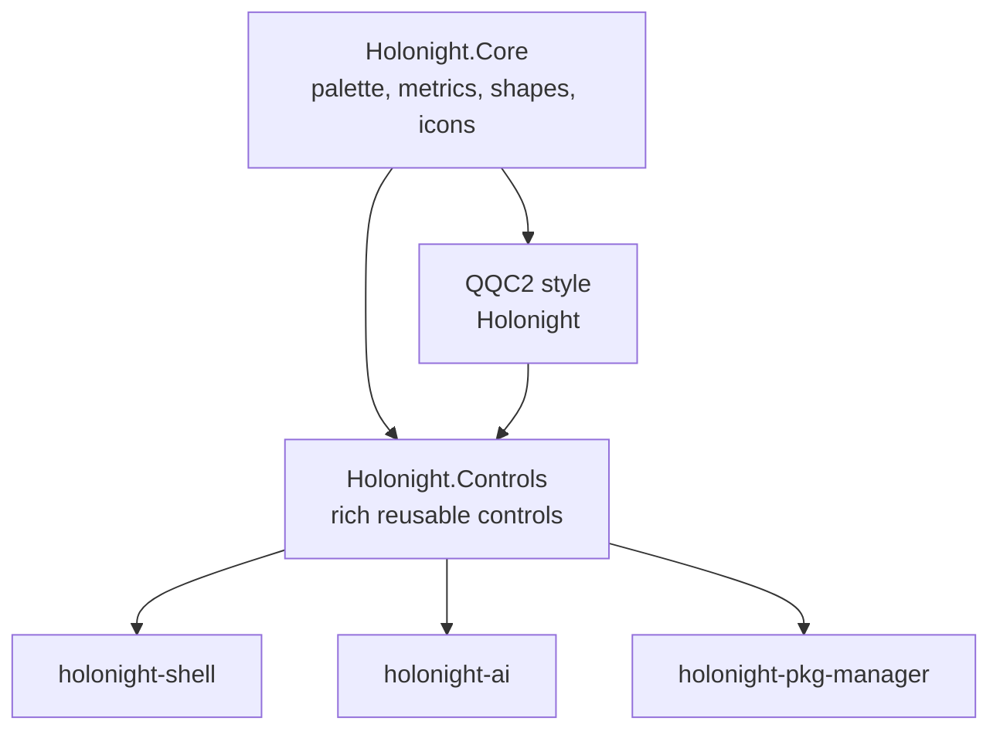

# Shared controls architecture

**Status:** Accepted foundation
**Date:** 2026-07-27

HoloNight Qt is the shared Qt UI/design-system package, not merely a QQC2 style. Rich controls therefore live in
this repository behind separately importable module boundaries.

I would not create a fourth repository such as `holonight-controls` yet. It would add packaging, versioning, and development overhead without establishing a genuinely independent product boundary.

## Recommended architecture



All applications depend on `holonight-qt`; none depend on `holonight-shell`.

Conceptually, `holonight-qt` would contain three layers:

| Layer                  | Responsibility                                                                  |
| ---------------------- | ------------------------------------------------------------------------------- |
| `Holonight.Core`       | Palette, semantic metrics, appearance settings, shapes, SVG/icon rendering      |
| QQC2 `Holonight` style | Implementations of standard `Button`, `TextField`, `ComboBox`, `CheckBox`, etc. |
| `Holonight.Controls`   | Rich HoloNight application controls composed from standard styled controls      |

Canonical module spellings are `Holonight.Core` and `Holonight.Controls`:

```qml
import Holonight.Controls
```

not `HoloNight.Controls` or the stale lowercase `holonight`.

## Repository layout

Something along these lines:

```text
holonight-qt/
├── src/
│   ├── core/
│   │   ├── palette/
│   │   ├── appearance/
│   │   ├── metrics/
│   │   ├── shapes/
│   │   └── icons/
│   │
│   ├── style/
│   │   └── QtQuick/Controls/Holonight/
│   │       ├── Button.qml
│   │       ├── TextField.qml
│   │       ├── ComboBox.qml
│   │       └── ...
│   │
│   └── qml/
│       └── Holonight/
│           ├── Core/
│           │   └── ...
│           └── Controls/
│               ├── HnSearchField.qml
│               ├── HnIconComboBox.qml
│               ├── HnFormField.qml
│               ├── HnTextArea.qml
│               ├── HnSettingsRow.qml
│               ├── HnApplicationWindow.qml
│               └── HnSurfaceFrame.qml
│
├── examples/
│   └── controls-gallery/
└── tests/
```

Installing the theme would install all three layers, but they remain logically separated. Ordinary Qt applications can select the HoloNight QQC2 style without importing the richer controls.

## What belongs in `Holonight.Controls`

A component belongs here when it is:

* useful in two or more HoloNight applications;
* independent of shell services and application domain models;
* configurable through generic properties, models, delegates and signals;
* part of the shared HoloNight interaction or visual language.

Likely candidates:

* `HnSearchField`
* `HnIconComboBox`
* `HnTextArea`
* `HnFormField`
* `HnSettingsRow`
* `HnSectionHeader`
* `HnEmptyState`
* `HnLoadingState`
* `HnApplicationWindow`
* `HnSurfaceFrame`
* generic cards, popovers and keyboard-focus indicators

The C++ SVG renderer also belongs in `Holonight.Core`, because exact semantic icon recoloring is useful across every application and should not be tied to the shell.

## What stays application-local

The shared library should provide mechanisms, not product concepts.

| Shared control                  | Application-owned composite                                   |
| ------------------------------- | ------------------------------------------------------------- |
| `HnSearchField`                 | `LauncherSearchField` with applications/files/clipboard modes |
| `HnIconComboBox`                | `DefaultApplicationPicker`                                    |
| `HnSettingsRow`                 | `AIProviderSettingsRow`                                       |
| `HnCard`                        | `PackageUpdateCard`                                           |
| `HnCodeView` if broadly useful  | AI message/tool-call rendering                                |
| `HnSurfaceFrame`                | shell-specific `HudFrame`                                     |
| Generic progress/status control | package transaction progress and Pacman behavior              |

For example, the shared combo box may understand `textRole`, `iconRole` and `valueRole`, but it must not understand desktop files or package backends.

Similarly, `HnSearchField` can expose leading/trailing content slots, clear behavior and perhaps generic mode support. The actual launcher modes and commands stay in `holonight-shell`.

## Support different sizes without overrides

Size differences should be part of the public API instead of being implemented by replacing backgrounds and content items in every application.

For example:

```qml
HnSearchField {
    sizeRole: HnControlSize.Large
    placeholderText: qsTr("Search applications…")
}
```

Useful semantic sizes might be:

```text
Compact
Normal
Large
Hero
```

These should resolve through shared metrics:

```text
controlHeightCompact
controlHeight
controlHeightLarge
controlHorizontalPadding
controlIconSize
```

There can be a process-wide default control density in `HnAppearance`, while individual controls override `sizeRole`. That supports:

* conventional sizing in general Qt applications;
* larger controls in settings, AI and package-manager windows;
* compact controls in the shell bar;
* prominent launcher search without a shell-specific visual reimplementation.

Avoid exposing raw `height: 52` as the normal customization mechanism.

## Design controls for composition

Rich controls should expose extension points rather than accumulating dozens of application-specific flags:

```qml
HnSearchField {
    leadingContent: ModeSelector { ... }
    trailingContent: ShortcutHint { text: "Ctrl K" }
}
```

The precise API might use delegates or named content properties, but the principle is important: applications add functionality around a stable input implementation without replacing its border, focus state, padding or keyboard behavior.

This also means fixes for fractional scaling, focus rings, borders and disabled colors are made once in `holonight-qt`.

## Dependency rules

I would enforce these rules:

1. `Holonight.Core` imports no application module and no rich-control module.
2. The QQC2 style may depend on `Holonight.Core`.
3. `Holonight.Controls` may depend on `Holonight.Core` and `QtQuick.Controls`.
4. Shared controls never import `holonight-shell`, AI or package-manager modules.
5. Application-specific components may import `Holonight.Controls`.
6. Cross-repository communication uses installed CMake/QML packages, not copied files or Git submodules.

Applications should consume a versioned package, conceptually:

```cmake
find_package(HolonightQt REQUIRED COMPONENTS Core Controls)
```

The installed CMake package preserves the repository's existing namespace:

```text
HolonightQt::Core
HolonightQt::Controls
```

## When a separate controls repository would make sense

Split out `holonight-ui` later only if one of these becomes true:

* it needs a release cadence independent of the theme;
* it supports multiple unrelated QQC2 styles;
* non-HoloNight projects start consuming it;
* its C++ dependencies become substantially heavier than the theme;
* maintaining it inside `holonight-qt` creates real packaging problems.

None appears true now. These controls are specifically the programmatic expression of the HoloNight Qt design system, so `holonight-qt` is their natural owner.

## Compatibility removal

Palette, theme, appearance, shapes, and icon rendering are owned by `Holonight.Core`; `HnSurfaceFrame` and
`HnApplicationWindow` are owned by `Holonight.Controls`. The temporary lowercase module and the shared-type
exports retained by `Holonight` have been removed after all known consumers adopted the canonical modules.

The first foundation cycle adds semantic sizing, `HnSearchField`, install/package support, contract tests, and a
separate controls gallery. The second cycle completes the shared input controls with `HnIconComboBox`,
`HnTextArea`, and `HnFormField`. The third cycle adds structural settings composition and caller-controlled empty
and loading states through `HnSettingsRow`, `HnSectionHeader`, `HnEmptyState`, and `HnLoadingState`. Process-wide
density and persisted density remain deferred.

## Follow-up pipeline

The compatibility layer has been removed. Every shared type now has one QML module owner.

So the revised boundary is:

> `holonight-qt` owns how reusable HoloNight Qt UI behaves and looks; each application owns what that UI means.

That preserves the original goal of unified Qt styling while giving all HoloNight applications a genuine shared component library—with no dependency on the shell.
