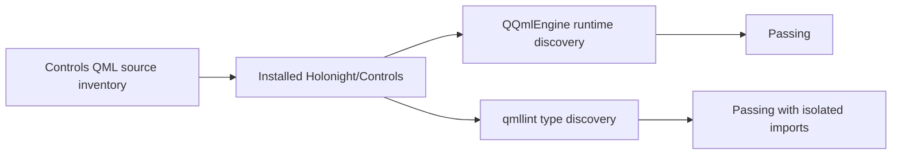

# DESIGN: Controls qmllint install metadata

**Spec:** `docs/sdd/controls-qmllint-install-metadata/SPEC.md`
**Status:** Implemented
**Date:** 2026-07-28

## Current boundary

`holonight_controls_qml` is a QML-only public module built with `qt_add_qml_module`. Its build and install rules
ship the plugin, `qmldir`, qmltypes file, public QML sources, the internal selectable delegate, and assets.
Runtime import and representative installed construction already passed. The installed qmltypes file contains
an empty `Module {}`, which is expected because the module has no plugin-supplied C++ types.

This separates the failure into two paths:

The reported unresolved types came from older Controls modules in the default user and system import paths, not
from the isolated package. Plain `-I` did not prevent those modules from being selected. `qmllint --bare` with
the test prefix and Qt's own QML root resolves every public type.

## Investigation result

Build-tree and install-tree `qmldir` files both declare all public QML types. The Controls qmltypes file contains
no components because `qmltyperegistrar` receives no C++ type registrations; the Core qmltypes file contains its
C++ singleton and enum registrations. QML-file types are discovered through `qmldir` and their source files.

Removing `prefer :/qt/qml/Holonight/Controls/` from a diagnostic installed copy did not make the non-isolated
command resolve the newer types. Running the same consumer with `--bare`, the isolated prefix, and Qt's QML root
did. Inspection then found stale Controls modules in both default installation roots with exactly the older
public surface reported by the warnings.

The correction keeps Qt-generated artifacts unchanged. It removes duplicated public source inventories and
adds hermetic installed-prefix lint coverage, which detects actual package omissions without consulting an
unrelated HoloNight installation.

## Canonical public inventory

Introduce or identify one CMake-level public Controls inventory. Use it to feed `qt_add_qml_module`, installation,
and generation of the installed-prefix lint consumer or an assertion that its type list is complete.

Keep internal files in a separate inventory. `HnSelectableDelegate.qml` remains packaged because compiled public
components depend on it, but it is marked `QT_QML_INTERNAL_TYPE` and excluded from the public lint consumer.
Assets remain a third, non-type inventory.

This organization makes these sets explicit:

| Inventory | QML module | Installed | Public lint consumer |
| --- | --- | --- | --- |
| Public controls | Yes | Yes | Yes |
| Internal controls | Yes, internal | Yes | No |
| Assets | Resource only | Yes | No |

## Installed-prefix regression

Extend package validation or add a focused CTest fixture that:

1. installs the current build into its existing isolated test prefix;
2. writes a syntactically valid consumer importing `QtQuick` and `Holonight.Controls`;
3. references each public type in a context that does not create unrelated required-property warnings;
4. runs the same Qt installation's `qmllint`;
5. uses `--bare` and supplies only the isolated QML root plus the matching Qt installation's QML root;
6. reports the command output and fails on any nonzero result.

Where a type requires a particular root object or properties, the generated consumer may use separate inline
components or files. Coverage is about type resolution and metadata consistency, not visual behavior.

The test shall not find the source or build QML roots through ambient environment variables. Existing runtime
package construction remains as a separate assertion so tooling success cannot mask a runtime regression.

## Verification sequence

Run the narrowest checks first:

1. configure/build the Controls QML module and inspect its generated metadata;
2. run the minimal build-tree and installed-prefix reproductions;
3. run the new installed-prefix public-surface lint test;
4. run Controls QML lint and focused runtime/package tests;
5. run `task build`, `task lint`, and `task test`;
6. run `git diff --check`.

## Downstream handoff

After the upstream fix is committed, record its revision and rebuild/install it at
`/tmp/holonight-qt-prefix`. The downstream `holonight-shell` checkpoint CP-S-001 can then retry
`NavPanel` with `HnNavigationDelegate`, its focused Settings test, `task qml-lint`, component construction,
diff validation, and visual-review screenshot. Its installed-prefix lint invocation must isolate the requested
prefix or otherwise ensure it precedes stale user/system HoloNight modules. Those downstream changes are not
part of this repository's SDD.

## Risks and mitigations

| Risk | Mitigation |
| --- | --- |
| A metadata-only workaround drifts from QML sources | Generate from the canonical inventory; avoid handwritten declarations |
| The test accidentally resolves the build tree | Clear ambient QML overrides and pass only the isolated prefix |
| Making the internal base public hides the failure | Assert that `HnSelectableDelegate` remains internal |
| Fixing lint breaks resource-based runtime loading | Retain and rerun build/install runtime construction tests |
| Qt-version-specific behavior makes the fix brittle | Record the confirmed toolchain behavior and use supported CMake/Qt mechanisms |
