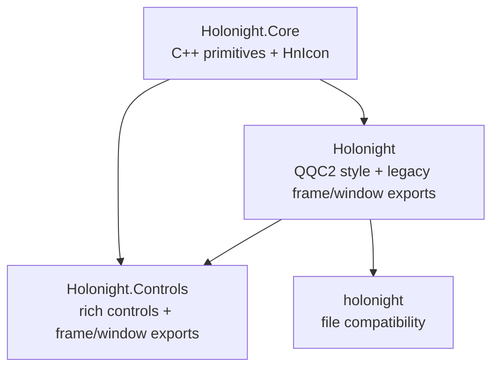

# DESIGN: Shared-controls compatibility migration

## Module ownership

`Holonight.Core` is the sole C++ registration owner for palette, theme, appearance, shapes, enums, and icon
rendering. `HnIcon.qml` is compiled into Core and imports Core directly.

The legacy `Holonight` module declares a module import of `Holonight.Core`. Qt exposes imported module types in the
importing namespace, so legacy names resolve to the canonical Core registrations and singleton instances instead
of a second registration. Existing styled controls can therefore continue resolving the same unqualified names.

The lowercase module remains a file-based compatibility module depending on `Holonight`. Its `HnIcon.qml` is a
thin subtype of `Holonight.Core.HnIcon`, preserving the inherited API and enum while avoiding a second maintained
implementation.

`HnSurfaceFrame.qml` and `HnApplicationWindow.qml` import only Core primitives and are compiled from the same
source files into both `Holonight` and `Holonight.Controls`. This keeps the maintained implementation singular
without introducing a `Holonight` → `Holonight.Controls` edge. Other rich controls may continue importing the
styled `Holonight` module.

## Build and install design

- Core links the existing theme, config, icon, and palette libraries required by its migrated registrations.
- The legacy plugin no longer compiles or links those registrations.
- Controls retains its existing CMake component and plugin target and gains the two shared component sources.
- Generated `qmldir` files carry the canonical import relationships.
- Installation includes owned QML files, plugins, `qmldir`, and `.qmltypes` metadata in the canonical trees.

No module version, package component, alias, external dependency, or public property changes.

## Verification design

Build-tree QML contracts instantiate every migrated type, exercise enum and singleton methods, verify frame/window
content ownership, and compare canonical and legacy singleton object identity. Existing legacy and lowercase smoke
tests remain authoritative for compatibility.

The install test configures a consumer against `HolonightQt::Core` and `HolonightQt::Controls`, checks installed
artifacts, imports canonical modules, then imports canonical, legacy, and lowercase namespaces together.
QML lint, headless CTest, and gallery launches cover metadata, linkage, and runtime integration.
