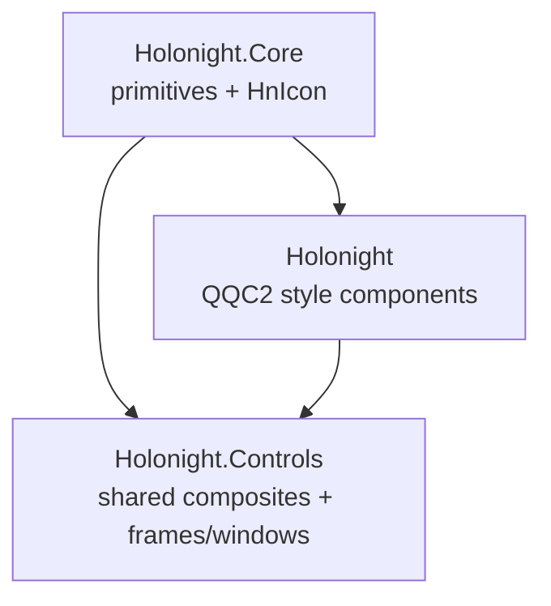

# DESIGN: Shared-controls compatibility removal

**Spec:** `docs/sdd/shared-controls-compatibility-removal/SPEC.md`
**Status:** Implemented
**Date:** 2026-07-28

## Final module ownership

The canonical modules become the only registration and packaging locations for shared types. `Holonight` remains
the QQC2 style module because styled controls are selected and instantiated through that URI; removing shared
exports does not remove or rename the style.

The removed lowercase module has no successor alias. Consumers select the canonical module that owns each type.

## QML and build changes

The `Holonight` QML target drops `HnApplicationWindow.qml` and `HnSurfaceFrame.qml` from its source and install
lists. Its module-wide Core import is removed so importing the style no longer exposes Core types transitively.
Each style implementation imports `Holonight.Core` directly wherever it uses canonical primitives.

The manual lowercase build-tree mirror, its `qmldir`, copied style sources, install rules, and
`compat/HnIcon.qml` are deleted. Core and Controls retain the existing maintained source files, resource aliases,
plugins, target dependencies, and install destinations.

Controls continue importing `Holonight` for styled bases and `Holonight.Core` for primitives. References to Core
types inside Controls use the explicit Core import rather than the style namespace.

## Verification design

Build-tree contracts instantiate representative styled controls from `Holonight`, every Core-owned public type
from `Holonight.Core`, and every shared control from `Holonight.Controls`. Tests that currently exercise shared
types through `Holonight` or `holonight` move to their canonical modules.

Package validation checks canonical plugins, metadata, sources, assets, CMake components, and imports. It also
checks that:

- no lowercase `holonight` install directory is produced;
- `Holonight` metadata does not export Core, frame, window, or icon types;
- canonical Core and Controls imports work together without duplicate singleton registrations.

All three QML lint targets, focused QML smoke tests, install-tree validation, the complete headless CTest suite,
and controls-gallery launches cover the final boundary.

## Rollout

This pipeline has no deprecation interval because the compatibility layer was introduced specifically for staged
consumer adoption and all known consumers have completed that adoption. The removal commit and release notes
shall call out the import break explicitly.
